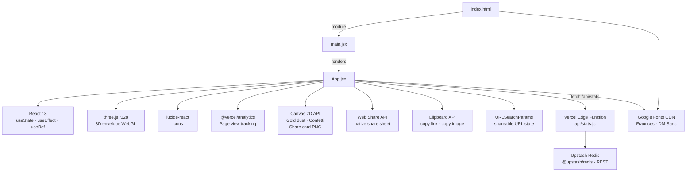

# Bustometro — Architecture

Vite 5 + React 18 SPA. No router. Mostly client-side; backend-lite via Vercel Edge Functions in `api/`.

---

## Folder structure

```
bustometro/
├── api/
│   └── stats.js              # Vercel Edge Function — social proof stats
├── public/
│   ├── favicon.svg           # SVG envelope icon
│   └── og-image.png          # Static OG image 1200×630
├── src/
│   ├── App.jsx                # Orchestrator: composes hooks + components, global <style>
│   ├── main.jsx                # React DOM entry point
│   ├── index.css               # CSS reset only
│   ├── constants.js            # VERSION, parentele, figure, regioni, presetCoperto, THEME
│   ├── components/             # Presentational components
│   ├── hooks/                  # Custom hooks (state + side effects)
│   └── utils/                  # Pure helpers (generateCard, mapParentela)
├── ai_docs/
│   └── ARCHITECTURE.md       # This file
├── index.html                # HTML shell, SEO meta, OG tags, Google Fonts
├── vite.config.js            # Vite + React plugin config
├── package.json
├── CHANGELOG.md
├── README.md
└── CLAUDE.md
```

### `src/` internal structure (post issue #18 component/hook extraction)

`App.jsx` is now a ~170-line orchestrator (was a single ~1216-line file). Logic is split as follows:

| Layer | File | What it contains |
|-------|------|-------------------|
| **Components** | `components/Atmosphere.jsx` | Canvas 2D particle system — gold dust + confetti burst |
| | `components/Envelope3D.jsx` | Three.js 3D envelope with mouse parallax and flap animation |
| | `components/Toast.jsx` | Bottom toast notification |
| | `components/Stepper.jsx` | +/− numeric stepper (adulti/bambini) |
| | `components/Header.jsx` | Title, version badge, social-proof stat line |
| | `components/StepParentela.jsx` / `StepPartecipanti.jsx` / `StepFigura.jsx` | The 3 form steps |
| | `components/ResultCard.jsx` | Computed amount, range, breakdown, easter egg, reset/copy-link |
| | `components/ShareCard.jsx` | Share card form (name, format) + download/WhatsApp/copy/native-share actions |
| | `components/Disclaimer.jsx` / `CreditsFooter.jsx` | Static disclaimer + collapsible credits |
| **Hooks** | `hooks/useCountUp.js`, `usePrefersReducedMotion.js`, `useStats.js` | Generic, side-effect-only hooks |
| | `hooks/useFormReducer.js` | Form state cluster (parentela/adulti/bambini/costoCoperto/figura/testimone/suocera/regione) via `useReducer`, incl. URL hydrate-on-mount |
| | `hooks/useCalcolo.js` | Business calculation (isComplete, arrotondato, range, easter egg, sweepKey) |
| | `hooks/useShareUrl.js`, `useStatsSubmit.js`, `useToast.js`, `useBusyGuard.js`, `useCardActions.js` | Share-link building, stats POST, toast, anti-double-tap guard, card download/copy/share actions |
| **Utils** | `utils/generateCard.js` | Pure Canvas 2D share-card renderer (no React, explicit params) |
| | `utils/mapParentela.js` | Maps parentela coefficient → stats category |
| **App.jsx** | — | Composes the above + global `<style>` (keyframes/animations) |

---

## Dependency graph



---

## State (Bustometro component)

| State | Type | Source | Description |
|-------|------|--------|-------------|
| `parentela` | `number \| null` | `hooks/useFormReducer.js` | Relationship coefficient (P): 2.0 · 1.5 · 1.2 · 1.0 |
| `adulti` | `number` | `hooks/useFormReducer.js` | Adults count (I), default 1 |
| `bambini` | `number` | `hooks/useFormReducer.js` | Children count (B), default 0 |
| `costoCoperto` | `number` | `hooks/useFormReducer.js` | Cover cost estimate (C), default €80 |
| `figura` | `number \| null` | `hooks/useFormReducer.js` | Style coefficient (D): 1.5 · 1.3 · 1.2 · 1.0 |
| `testimone` | `boolean` | `hooks/useFormReducer.js` | Witness mode — applies ×1.3 multiplier on total (default `false`) |
| `suocera` | `boolean` | `hooks/useFormReducer.js` | Mother-in-law mode — cosmetic note, no calculation change (default `false`) |
| `regione` | `'nord' \| 'centro' \| 'sud'` | `hooks/useFormReducer.js` | Regional preset selector (drives `costoCoperto` + `figura` via `selectRegione`), default `'centro'` |
| `nomineSposi` | `string` | `App.jsx` (local `useState`) | Optional couple name for share card |
| `cardFormat` | `'story' \| 'post'` | `App.jsx` (local `useState`) | Canvas export format |
| `showBreakdown` / `showCredits` | `boolean` | `App.jsx` (local `useState`) | UI accordion toggles |
| `stats` | `object \| null` | `hooks/useStats.js` | Social proof data from `/api/stats`; `null` = unavailable (graceful degradation) |

`useFormReducer` backs the 8 form fields above with a single `useReducer` (composite actions: `selectRegione`, `reset`, URL hydrate-on-mount) while exposing the same per-field getter/setter API as before.

`isComplete = parentela !== null && figura !== null` (computed in `hooks/useCalcolo.js`)

---

## Shareable URL params

Built by `buildShareUrl()` in `hooks/useShareUrl.js`; hydrated on mount by `hooks/useFormReducer.js`.

```
?p=<parentela>&i=<adulti>&b=<bambini>&c=<costoCoperto>&d=<figura>&r=<regione>[&t=1][&s=1]
```

Example: `?p=1.2&i=2&b=1&c=120&d=1.3&r=centro&t=1`

| Param | Description |
|-------|-------------|
| `p` | Parentela coefficient |
| `i` | Adults count |
| `b` | Children count |
| `c` | Cover cost |
| `d` | Figura coefficient |
| `r` | Regione (`nord` \| `centro` \| `sud`) |
| `t` | `1` if Testimone mode active (omitted when false) |
| `s` | `1` if Suocera mode active (omitted when false) |

---

## Backend / API

Edge Functions live in `api/` at the project root. Vercel auto-detects them.

### `api/stats.js`
| | |
|---|---|
| Runtime | Vercel Edge (`export const config = { runtime: 'edge' }`) |
| Storage | Upstash Redis via `@upstash/redis` (`Redis.fromEnv()`) |
| Env vars | `KV_REST_API_URL` + `KV_REST_API_TOKEN` (Vercel Marketplace naming) — o `UPSTASH_REDIS_REST_URL`/`UPSTASH_REDIS_REST_TOKEN` in alternativa |

**GET `/api/stats`** — monthly aggregates, CDN-cached 5 min (`s-maxage=300, stale-while-revalidate=600`).  
Returns `{ available, month, total, categories: { amici, cugini, fratelli, genitori: { avg } } }`.  
On Redis error → `{ available: false }` (graceful degradation).

**POST `/api/stats`** — anonymous increment.  
Body: `{ category: string, amount: number }`. Validates strictly (known category, amount 30–2000).  
On Redis error → `204` silent (never blocks client).

### Redis key schema (month = `YYYY-MM`, TTL ~40 days)
```
stats:count:<YYYY-MM>                # global monthly counter
stats:sum:<category>:<YYYY-MM>       # sum of amounts per category
stats:cnt:<category>:<YYYY-MM>       # count of submissions per category
```
TTL is refreshed on every write via `EXPIRE`. Keys auto-expire ~40 days after last write.
