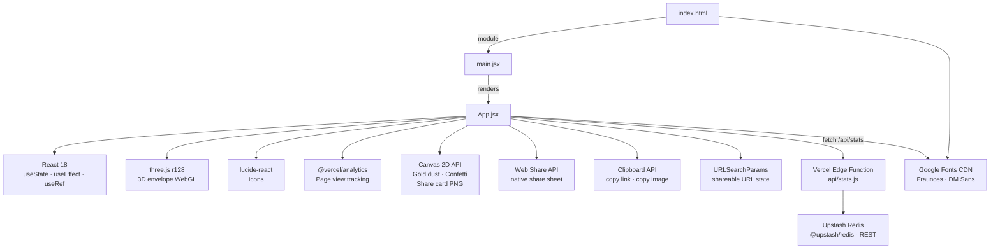

# Bustometro — Architecture

Vite 5 + React 18 SPA. No router. Mostly client-side; backend-lite via Vercel Edge Functions in `api/`.

---

## Folder structure

```
bustometro/
├── api/
│   └── stats.js              # Vercel Edge Function — social proof stats
├── public/
│   ├── favicon.svg           # SVG envelope icon
│   └── og-image.png          # Static OG image 1200×630
├── src/
│   ├── App.jsx               # Entire app: hooks, components, logic, styles
│   ├── main.jsx              # React DOM entry point
│   └── index.css             # CSS reset only
├── ai_docs/
│   └── ARCHITECTURE.md       # This file
├── index.html                # HTML shell, SEO meta, OG tags, Google Fonts
├── vite.config.js            # Vite + React plugin config
├── package.json
├── CHANGELOG.md
├── README.md
└── CLAUDE.md
```

### `src/App.jsx` internal structure (single file, ~980 lines)

| Section | What it contains |
|---------|-----------------|
| **Hooks** | `useCountUp`, `usePrefersReducedMotion`, `useStats` |
| **Helpers** | `mapParentela(coeff)` — maps parentela coefficient to stat category |
| **Atmosphere** | Canvas 2D particle system — gold dust + confetti burst |
| **Envelope3D** | Three.js 3D envelope with mouse parallax and flap animation |
| **Bustometro** | Main component — all state, form logic, Canvas card generation, share actions |

---

## Dependency graph



---

## State (Bustometro component)

| State | Type | Description |
|-------|------|-------------|
| `parentela` | `number \| null` | Relationship coefficient (P): 2.0 · 1.5 · 1.2 · 1.0 |
| `adulti` | `number` | Adults count (I), default 1 |
| `bambini` | `number` | Children count (B), default 0 |
| `costoCoperto` | `number` | Cover cost estimate (C), default €80 |
| `figura` | `number \| null` | Style coefficient (D): 1.5 · 1.3 · 1.2 · 1.0 |
| `nomineSposi` | `string` | Optional couple name for share card |
| `cardFormat` | `'story' \| 'post'` | Canvas export format |
| `testimone` | `boolean` | Witness mode — applies ×1.3 multiplier on total (default `false`) |
| `suocera` | `boolean` | Mother-in-law mode — cosmetic note, no calculation change (default `false`) |
| `stats` | `object \| null` | Social proof data from `/api/stats`; `null` = unavailable (graceful degradation) |

`isComplete = parentela !== null && figura !== null`

---

## Shareable URL params

```
?p=<parentela>&i=<adulti>&b=<bambini>&c=<costoCoperto>&d=<figura>[&t=1][&s=1]
```

Example: `?p=1.2&i=2&b=1&c=120&d=1.3&t=1`

| Param | Description |
|-------|-------------|
| `p` | Parentela coefficient |
| `i` | Adults count |
| `b` | Children count |
| `c` | Cover cost |
| `d` | Figura coefficient |
| `t` | `1` if Testimone mode active (omitted when false) |
| `s` | `1` if Suocera mode active (omitted when false) |

---

## Backend / API

Edge Functions live in `api/` at the project root. Vercel auto-detects them.

### `api/stats.js`
| | |
|---|---|
| Runtime | Vercel Edge (`export const config = { runtime: 'edge' }`) |
| Storage | Upstash Redis via `@upstash/redis` (`Redis.fromEnv()`) |
| Env vars | `UPSTASH_REDIS_REST_URL`, `UPSTASH_REDIS_REST_TOKEN` (Vercel dashboard + `.env.local`) |

**GET `/api/stats`** — monthly aggregates, CDN-cached 5 min (`s-maxage=300, stale-while-revalidate=600`).  
Returns `{ available, month, total, categories: { amici, cugini, fratelli, genitori: { avg } } }`.  
On Redis error → `{ available: false }` (graceful degradation).

**POST `/api/stats`** — anonymous increment.  
Body: `{ category: string, amount: number }`. Validates strictly (known category, amount 30–2000).  
On Redis error → `204` silent (never blocks client).

### Redis key schema (month = `YYYY-MM`, TTL ~40 days)
```
stats:count:<YYYY-MM>                # global monthly counter
stats:sum:<category>:<YYYY-MM>       # sum of amounts per category
stats:cnt:<category>:<YYYY-MM>       # count of submissions per category
```
TTL is refreshed on every write via `EXPIRE`. Keys auto-expire ~40 days after last write.
